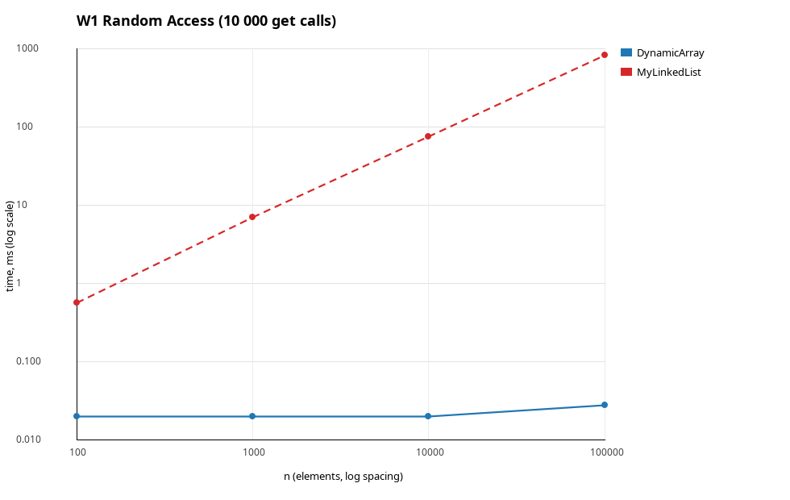
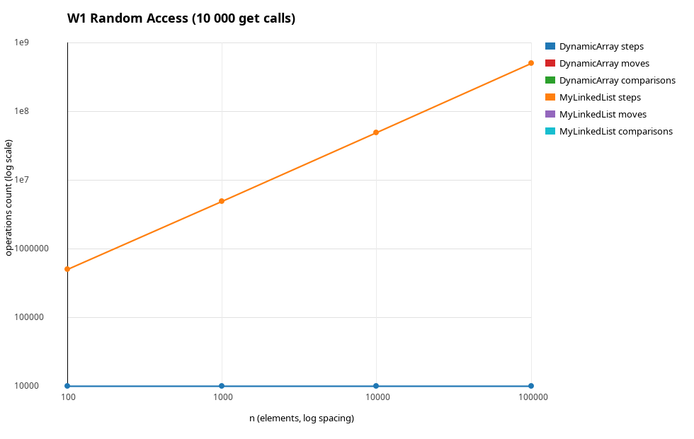
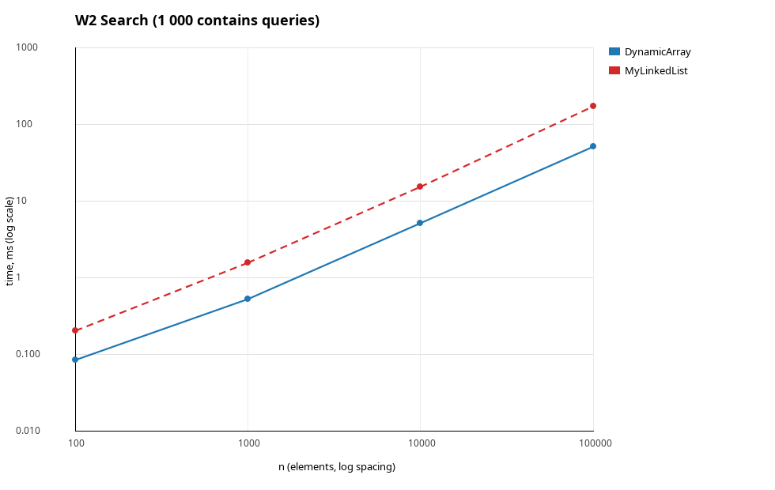
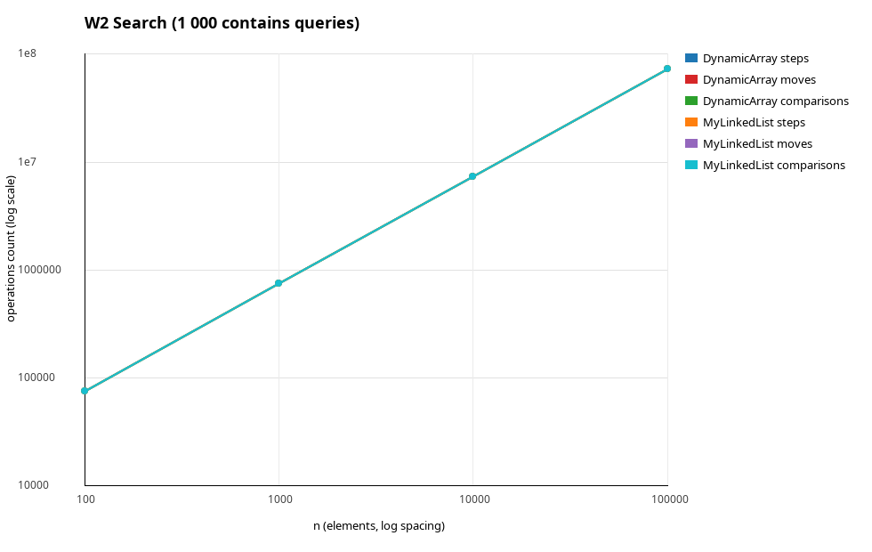
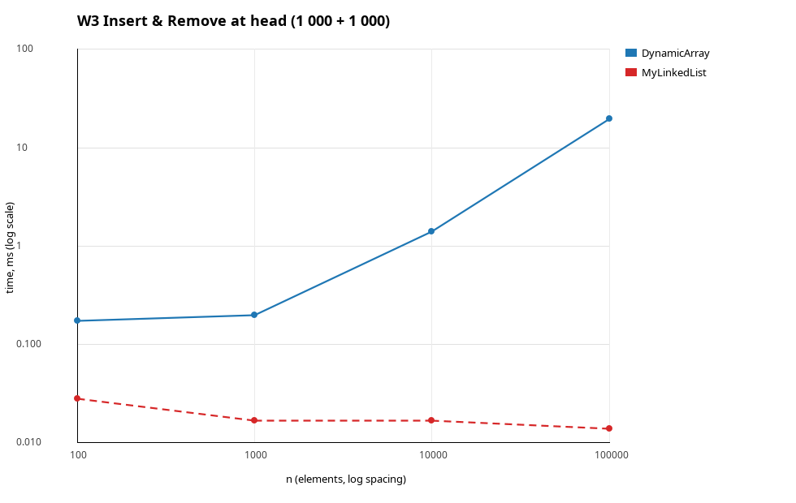
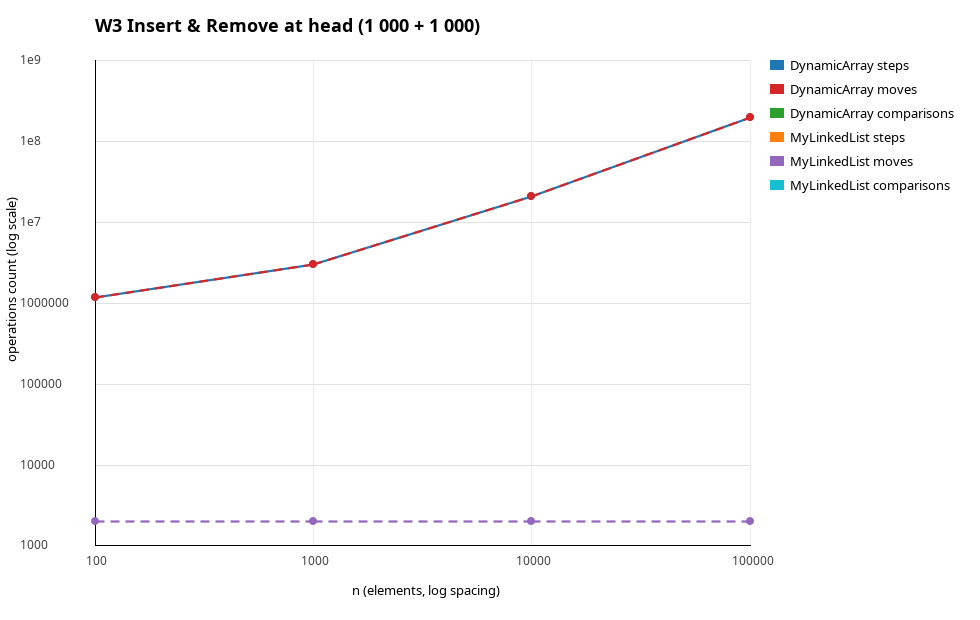
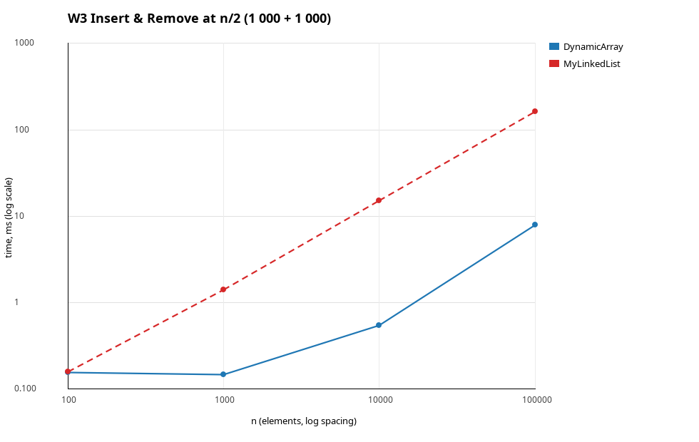
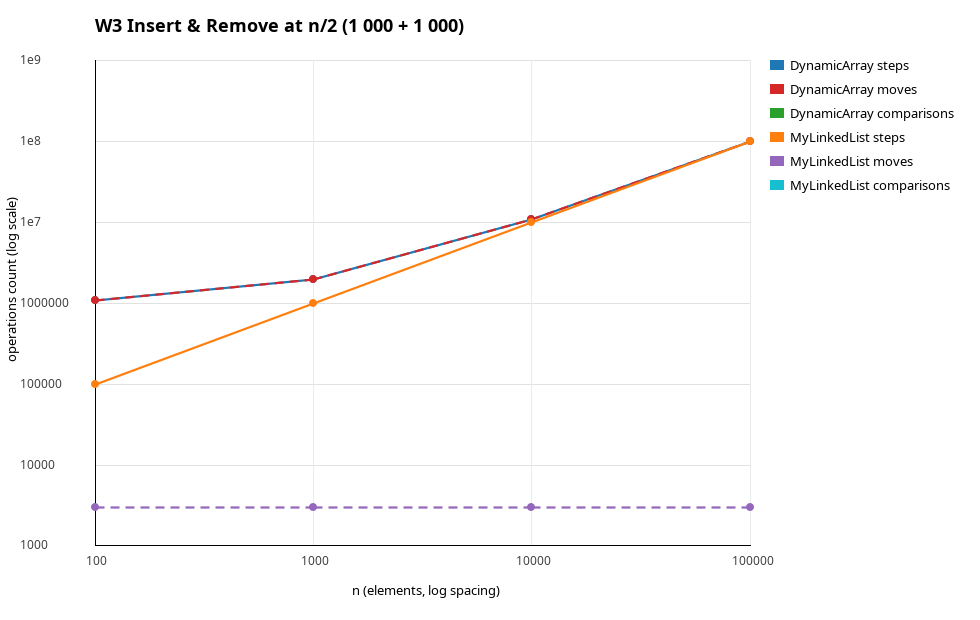
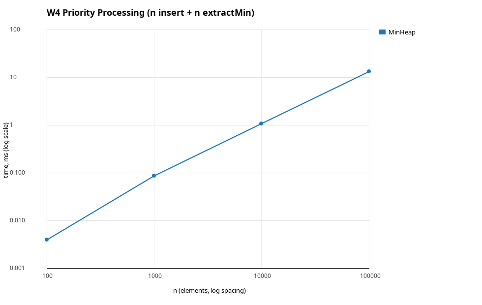
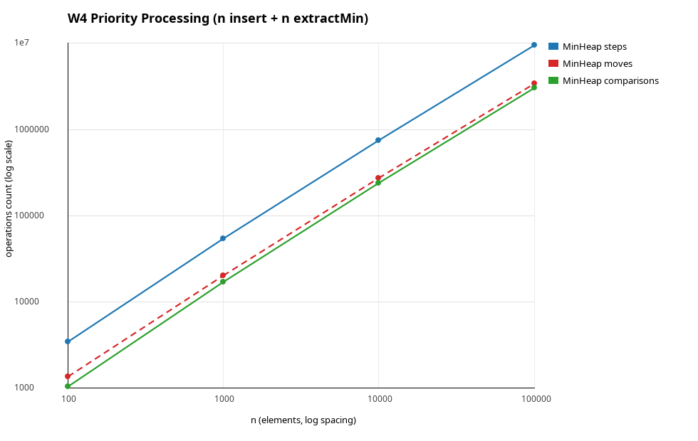

# DAA Assignment 2 - Report

Author: Taubakabyl Nurlybek
Structures: `DynamicArray`, `MyLinkedList` (singly linked, head + tail), `MinHeap` (array based binary heap).
All of them store primitive `int`, no `java.util` collections are used in `src/main/java`.

---

## 1. Complexity table

n is the number of stored elements. "Aux space" is the extra memory used by one call.

### DynamicArray

| Operation | Best | Average | Worst | Aux space | Justification |
|---|---|---|---|---|---|
| `add(x)` | Θ(1) | Θ(1) amortized | Θ(n) | O(1), O(n) on resize | Writes one cell; when the array is full it copies n elements into a 2x buffer, and the copies over k appends sum to less than 2k. |
| `add(index, x)` | Θ(1) | Θ(n) | Θ(n) | O(1) | Best case `index == size` (no shift); otherwise n - index elements move, which is n/2 on average and n for index 0. |
| `remove(index)` | Θ(1) | Θ(n) | Θ(n) | O(1) | Symmetric to insertion: the last index shifts nothing, index 0 shifts n - 1 elements. |
| `get(index)` | Θ(1) | Θ(1) | Θ(1) | O(1) | One bounds check and one indexed read, independent of n. |
| `contains(x)` | Ω(1) | Θ(n) | Θ(n) | O(1) | Linear scan: best case is a hit at index 0, a miss always reads all n cells. |
| storage | - | - | - | Θ(n) | One `int[]` of capacity between n and 2n, no per-element object. |

### MyLinkedList

| Operation | Best | Average | Worst | Aux space | Justification |
|---|---|---|---|---|---|
| `add(x)` | Θ(1) | Θ(1) | Θ(1) | O(1) | The `tail` pointer is kept, so appending is two pointer writes and never traverses. |
| `add(index, x)` | Θ(1) | Θ(n) | Θ(n) | O(1) | Index 0 and index n are O(1) (head / tail), any other index first walks index - 1 nodes. |
| `remove(index)` | Θ(1) | Θ(n) | Θ(n) | O(1) | Index 0 only re-points `head`; otherwise the predecessor must be found by walking. |
| `get(index)` | Ω(1) | Θ(n) | Θ(n) | O(1) | Walks index + 1 nodes from the head; a uniformly random index gives n/2 hops. |
| `contains(x)` | Ω(1) | Θ(n) | Θ(n) | O(1) | Same scan as the array, but every step is a pointer dereference. |
| storage | - | - | - | Θ(n) | n `Node` objects: 16 B header + 4 B value + 8 B pointer + padding = 24-32 B per element against 4 B in the array. |

### MinHeap

| Operation | Best | Average | Worst | Aux space | Justification |
|---|---|---|---|---|---|
| `insert(x)` | Θ(1) | Θ(1) amortized | Θ(log n) | O(1), O(n) on resize | Bubble-up stops at the first parent that is not greater; for random input it stops after a constant number of levels on average, the path is at most ⌊log₂ n⌋. |
| `peekMin()` | Θ(1) | Θ(1) | Θ(1) | O(1) | The minimum is always `data[0]`. |
| `extractMin()` | Θ(1) | Θ(log n) | Θ(log n) | O(1) | The last element moves to the root and sinks; it almost always comes from the bottom level, so the path is Θ(log n) and Ω(1) only when the heap has one or two elements. |
| storage | - | - | - | Θ(n) | One `int[]` of capacity between n and 2n, the tree structure is implicit in the indices. |

---

## 2. Loop invariants

### 2.1 `DynamicArray.contains(int value)`

```java
for (int i = 0; i < size; i++) {
    metrics.step();
    metrics.compare();
    if (data[i] == value) {
        return true;
    }
}
return false;
```

**Invariant.** Before every iteration with counter `i` it holds that `0 <= i <= size` and
no cell of `data[0..i-1]` is equal to `value`.

**Initialization.** Before the first iteration `i = 0`, so the range `data[0..-1]` is empty and the
statement "no cell in it equals `value`" is vacuously true; `0 <= 0 <= size` also holds.

**Maintenance.** Assume the invariant holds at the start of an iteration with index `i`.
The body compares `data[i]` with `value`. If they are equal the loop does not continue, so there is
nothing to maintain. If they are not equal, then together with the invariant no cell of
`data[0..i]` equals `value`, and after `i++` the new counter `i' = i + 1` satisfies
"no cell of `data[0..i'-1]` equals `value`" and `0 <= i' <= size`.

**Termination.** The loop ends in two ways. (a) `return true` inside the body: it is executed only
after the test `data[i] == value` succeeded, so the value really is in the structure. (b) The test
`i < size` fails with `i = size`: by the invariant no cell of `data[0..size-1]`, that is no stored
element, equals `value`, and `false` is returned.

**Conclusion.** In both exits the returned answer matches the real content of `data[0..size-1]`,
therefore `contains` is correct. The counter `i` grows by exactly 1 per iteration and is bounded by
`size`, so the loop always terminates after at most n iterations.

### 2.2 `MinHeap.bubbleDown(int index)`

```java
while (true) {
    int left = 2 * index + 1, right = left + 1, smallest = index;
    if (left < size)  { if (data[left]  < data[smallest]) smallest = left;  }
    if (right < size) { if (data[right] < data[smallest]) smallest = right; }
    if (smallest == index) return;
    swap(index, smallest);
    index = smallest;
}
```

**Invariant.** Before every iteration the heap property `data[(k-1)/2] <= data[k]` holds for every
node `k` in `1..size-1` **except possibly** for the children of `index`; in addition, every ancestor
of `index` is not greater than every element of the subtree rooted at `index`.

**Initialization.** `bubbleDown` is called from `extractMin` right after the last element was copied
into the root. Both subtrees of the root were valid heaps before the call and were not modified, so
the only node that may violate the property is the root itself, which is exactly `index = 0`. The
second part is vacuous because the root has no ancestors.

**Maintenance.** Assume the invariant holds for `index`. The body picks `smallest` as the index of
the minimum of `data[index]` and its existing children. If `smallest == index` the loop exits.
Otherwise `data[smallest] < data[index]`, and after the swap the node `index` holds that minimum, so
it is not greater than both of its children, and it is not smaller than its ancestors (the minimum of
the subtree was already not smaller than them), hence the property is restored at `index` and still
holds for the ancestors. The only node that may now violate it is the child `smallest`, which
receives the old (larger) value, and this node becomes the new `index`, so the invariant holds again.

**Termination.** Each iteration sets `index` to `2*index + 1` or `2*index + 2`, so the index at
least doubles and after at most ⌊log₂ n⌋ iterations the node has no children inside the heap, and
`smallest == index` forces the exit. At the exit no node violates the heap property: the exception
allowed by the invariant is the set of children of `index`, and the exit condition states precisely
that `data[index]` is not greater than those children.

**Conclusion.** When `bubbleDown` returns, `data[0..size-1]` is a valid min-heap again, so the value
returned earlier by `extractMin` was the minimum and the next `peekMin` is also correct. Because the
loop runs at most ⌊log₂ n⌋ times, `extractMin` costs O(log n).

---

## 3. Measured results

Machine: JDK 25, Linux x86-64. Median of 5 measured runs after 3 warm-up runs, `new Random(42)`.
Full data: [results/results.csv](results/results.csv).

| Workload | Structure | n = 100 | n = 1 000 | n = 10 000 | n = 100 000 |
|---|---|---|---|---|---|
| W1 time, ms | DynamicArray | 0.020 | 0.020 | 0.020 | 0.028 |
| W1 time, ms | MyLinkedList | 0.572 | 7.055 | 76.422 | 832.302 |
| W2 time, ms | DynamicArray | 0.086 | 0.533 | 5.206 | 52.094 |
| W2 time, ms | MyLinkedList | 0.205 | 1.592 | 15.692 | 175.103 |
| W3 head time, ms | DynamicArray | 0.174 | 0.198 | 1.401 | 19.877 |
| W3 head time, ms | MyLinkedList | 0.028 | 0.017 | 0.017 | 0.014 |
| W3 middle time, ms | DynamicArray | 0.155 | 0.149 | 0.544 | 8.034 |
| W3 middle time, ms | MyLinkedList | 0.159 | 1.407 | 15.161 | 162.620 |
| W4 time, ms | MinHeap | 0.004 | 0.087 | 1.076 | 13.598 |

Counter highlights at n = 100 000:

| Case | steps | moves | comparisons |
|---|---|---|---|
| W1 DynamicArray | 10 000 | 0 | 0 |
| W1 MyLinkedList | 502 499 208 | 0 | 0 |
| W2 both structures | 73 197 644 | 0 | 73 197 644 |
| W3 head DynamicArray | 201 000 000 | 201 000 000 | 0 |
| W3 head MyLinkedList | 0 | 2 000 | 0 |
| W3 middle DynamicArray | 101 000 000 | 101 000 000 | 0 |
| W3 middle MyLinkedList | 100 000 000 | 3 000 | 0 |
| W4 MinHeap | 9 506 724 | 3 388 058 | 3 059 333 |

### Plots

W1 Random Access:




W2 Search:




W3 Insert & Remove at head:




W3 Insert & Remove at n/2:




W4 Priority Processing:




In the charts a dashed line is the `moves` series (and `MyLinkedList` on the time charts).
A series that is constantly zero (for example `moves` in W2) is not drawn on the logarithmic axis.

---

## 4. Discussion

`get(i)` in `DynamicArray` is one address computation and one load, so W1 stays at 0.020 ms for every
n, while `MyLinkedList` needs i pointer hops and grows from 0.57 ms to 832 ms - a 30 000x gap at
n = 100 000 that the counters confirm (10 000 steps against 502 million). The interesting part is W2,
where both structures execute exactly the same 73 197 644 steps and comparisons, and the array is
still about 3x faster. The reason is memory layout: the array holds 4-byte values back to back, so
one 64-byte cache line brings 16 elements and the hardware prefetcher predicts the next line
perfectly, which means roughly one cache miss per 16 elements. The list stores every value in a
separate `Node` object with a 16-byte header and an 8-byte pointer, so one element costs 24-32 bytes
and the next address is only known after the current load returns - a dependent load chain
(pointer chasing) that the prefetcher cannot anticipate and that cannot be overlapped by the
out-of-order engine. Allocating n nodes also puts pressure on the garbage collector and spreads the
data over the heap, so the effective working set of the list at n = 100 000 is several megabytes
instead of 400 KB and no longer fits into L2.

This is why equal Big-O and even equal step counts do not imply equal time: the asymptotic model
charges 1 for every memory access, but a real access costs between 1 and 200 cycles depending on
where the data lives. The same effect explains the surprisingly fast shifts in W3 middle: 101 million
array moves take only 8.0 ms because the JIT vectorises the shift loop and the whole array is
cache-resident, giving more than 12 billion moved elements per second, which no pointer-based
structure can match. The list wins only where it touches no memory it does not need: in W3 head it
performs 2 000 pointer updates and 0 traversal steps, so its time is flat at 0.014-0.028 ms for all
n, while the array has to shift up to 201 million elements and degrades to 19.9 ms. So `MyLinkedList` is the
right choice when all work happens at the ends - queues, stacks, LRU chains, free lists, or splicing
when a node reference is already known - and when stable element addresses matter. `DynamicArray` is
the default for everything else: random access, iteration, search, and any size where cache locality
dominates. `MinHeap` solves a different problem: it keeps the minimum available in O(1) and pays only
O(log n) per update, so n insertions plus n extractions of 100 000 elements take 13.6 ms, whereas
keeping the same jobs in a sorted array would cost Θ(n) moves per insertion. Its array layout also
keeps it cache-friendly near the root, where most comparisons happen. For priority scheduling it is
therefore strictly better than both lists, but it gives no indexed access and no ordered iteration,
which is exactly the trade-off that makes three separate structures necessary.
